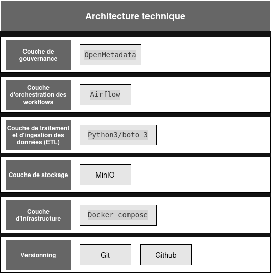
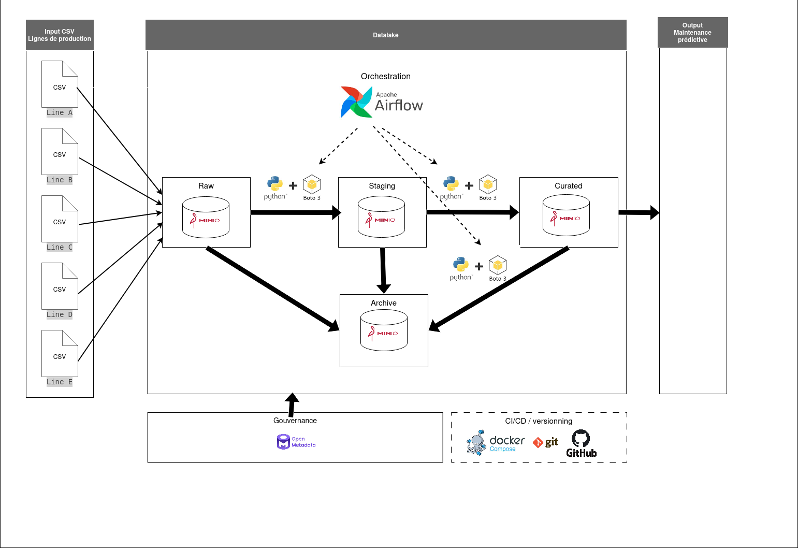

# Datalake IoT industry

Ce datalake a pour but de centraliser, documenter et sécuriser les données d'un ensemble de lignes de production d'un équipementier automobile afin de servir de base pour un futur projet de maintenance prédictive.

## Sommaire

- [Description](#description)
- [Données initiales des flux](#données-initiales-des-flux)
- [Technologies](#technologies)
- [Diagramme d'architecture technique](#diagramme-darchitecture-technique)
- [Couches](#couches)
- [RBAC](#rbac)
- [Gouvernance](#gouvernance)
- [Fonctionnalités](#fonctionnalités)
- [Guide de déploiement](#guide-de-déploiement)
- [Source](#source)

## Description

Ce datalake intègre les données de 5 lignes de production instrumentées de capteurs (température, pression, temps de fonctionnement). Chacune de ces lignes de production présentent un comportement distinct.

Le but de ce projet "Simplon IoT industry" est de centraliser, documenter et sécuriser l'ensemble de ces flux dans le datalake de ce dépôt. Une gouvernance ainsi qu'un contrôle des accès différencié aux données en fonction du rôle de l'utilisateur sont également intégrés à l'architecture.

Ces données sont ingérées, puis structurées, harmonisées et transformées au besoin afin de faciliter leur découverte, leur traçabilité, leur sécurisation et leur réutilisation par les différentes parties prenantes.

Ces données en sortie alimenterons un futur modèle d'intelligence artificielle utilisé pour détecter les anomalies ou anticiper les pannes dans le cadre d'un projet de maintenance prédictive.

## Données initiales des flux

Les flux en entrée sont composés des données suivantes:

- timestamp : La date et heure de la mesure
- temperature : La température dans une unité arbitraire
- pressure : La pression dans une unité arbitraire
- label : Indicateur d'anomalie (1 = anomalie, 0 = pas d'anomalie)
- elapsed_time(sur une partie des lignes) : temps de fonctionnement de l'appareil en unité arbitraire

## Technologies

Les technologiezs suivantes sont employées pour ce projet

- MinIO Community (Docker)
- OpenMetadata
- Airflow
- Python / boto3
- Docker Compose
- Git

## Diagramme d'architecture technique

Ces technlogies s'organisent de la manière suivante:




## Couches

Notre datalake est organisé avec les couches suivantes:

- **Raw:** données brutes issues des CSV données en entrée
- **Staging:** données nettoyées
- **Curated:** données optimisées en vue de la maintenance prédictive
- **Archive:** données archivées au bout de 180 jours. Elles seront supprimées au bout de 2 ans

## RBAC

|                      | data-analyst | data-engineer | admin |
| -------------------- | ------------ | ------------- | ----- |
| Lecture sur Raw      | ❌           | ✅            | ✅    |
| Écriture sur Raw     | ❌           | ✅            | ✅    |
| Lecture sur Staging  | ❌           | ✅            | ✅    |
| Écriture sur Staging | ❌           | ✅            | ✅    |
| Lecture sur Curated  | ✅           | ✅            | ✅    |
| Écriture sur Curated | ❌           | ✅            | ✅    |

## Gouvernance

(à venir)

## Fonctionnalités

(à venir)

## Guide de déploiement

Ce datalake est conteneurisé au moyen d'un docker compose, pour le lancer:

```
docker compose -f docker-compose.datalake.yml up -d
docker compose -f docker-compose.airflow.yaml up
docker compose -f docker-compose.openmetadata.yml up
```

Minio se trouve à l'adresse suivante:

```
http://localhost:9001
```

Et Airflow à l'adresse suivante:

```
http://localhost:8080
```

OpenMetadata quant à lui se trouve à cette adresse:

```
http://localhost:8585
```

Pur chacune des deux plate-forme, un nom d'utilisateur et un mot de passe sera demandé. Employer ceux du fichier .env

## Source

Ce projet est employé dans un cadre scolaire, les données sont issues de la source suivante:

- [Carneiro, D., Torres, D., & Peixoto, E. (2025). "Synthetic Data from Industrial Sensor Monitoring". ZENODO.](https://zenodo.org/records/15277168)
